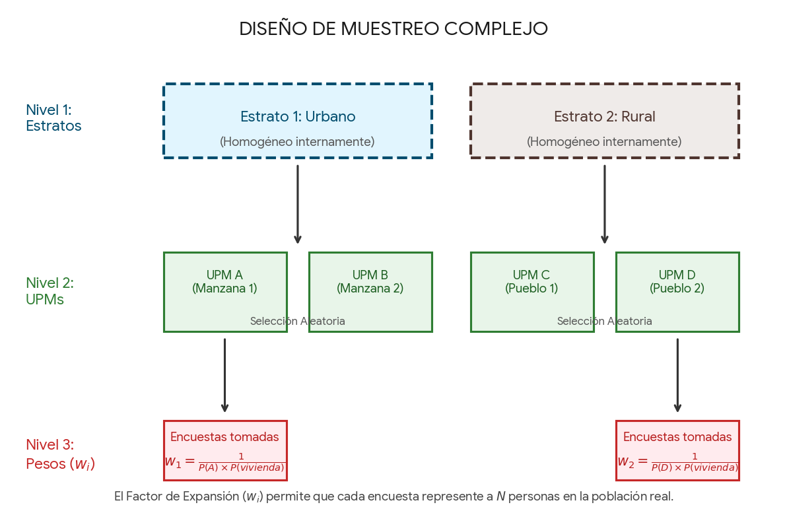

El análisis de la realidad socioeconómica exige herramientas que vayan más allá de los promedios simples. Las encuestas de hogares modernas emplean un **diseño muestral complejo** —que incluye estratificación, conglomerados y factores de expansión— para garantizar que una muestra pequeña represente fielmente a toda la población de un país. Sin embargo, los fenómenos sociales no ocurren en el vacío: el gasto, la pobreza y el empleo tienen una fuerte dependencia geográfica. Al integrar estos diseños complejos con **datos espaciales**, transformamos bases de datos tabulares abstractas en capas geográficas vivas. Esta sinergia no solo nos permite corregir los sesgos estadísticos propios de la recolección de datos, sino también proyectar la información sobre el territorio, revelando patrones, brechas y dinámicas invisibles a simple vista mediante el poder de la visualización cartográfica.

.

🧠 **¿Qué es una encuesta de diseño muestral complejo?**

Una **encuesta de diseño muestral complejo** es aquella que se aleja del muestreo aleatorio simple (el clásico método de "sacar nombres de una tómbola" donde todos tienen la misma probabilidad de ser elegidos) debido a la logística, los costos y la geografía del mundo real.

Para encuestar a todo un país, los institutos de estadística (como el INEGI.) no pueden mandar encuestadores a casas elegidas al azar por todo el territorio. En su lugar, organizan el muestreo de forma estratégica combinando tres elementos clave:

.

**Los 3 Pilares del Diseño Complejo**

Para entender cómo funcionan, imagina que vas a hacer una encuesta de gasto en un país. El diseño de encuestas complejas divide la población de forma jerárquica para optimizar costos logísticos y asegurar la representatividad estadística:

1.  **Estratos (Estratificación):** Consiste en dividir a toda la población en grupos mutuamente excluyentes que comparten características similares (por ejemplo: zonas urbanas versus rurales, o niveles socioeconómicos alto, medio y bajo). Se asegura que todos los grupos importantes queden representados en la muestra final.

2.  **Unidades Primarias de Muestreo (UPM):** Son los conglomerados físicos o geográficos que se seleccionan en la primera etapa del muestreo dentro de cada estrato (por ejemplo: manzanas catastrales, municipios o escuelas). En lugar de dispersar a los encuestadores por todo el país, se eligen ciertas UPMs al azar y la recolección de datos se concentra únicamente dentro de ellas.

3.  **Pesos o Factores de Expansión (pesos muestrales):** Como la probabilidad de seleccionar a cada persona ya no es la misma (debido a los estratos y los conglomerados), cada fila de tu base de datos viene con un "peso" o factor de expansión.

    -   *Ejemplo:* Si una persona tiene un factor de expansión de `150`, significa que esa persona y sus respuestas **representan a 150 personas** en la población real del país.

.

Por ejemplo, si el diseño muestral incorpora la distinción entre áreas urbanas y rurales como variables de estratificación, el esquema operaría de la siguiente manera:



.

.

**Las Implicaciones de Ignorar el Diseño Muestral Complejo**

Cuando trabajamos con encuestas nacionales de gasto o empleo, es muy tentador tratarlas como si fueran una simple planilla de Excel y aplicar las funciones estadísticas tradicionales (como un promedio directo o una desviación estándar común). Sin embargo, ignorar —o **soslayar**— el diseño muestral complejo con el que fueron construidos estos datos tiene consecuencias graves que distorsionan por completo la realidad que intentamos mapear.

Las dos principales implicaciones técnicas de cometer este error son:

**1. Sesgo en las Estimaciones (Puntos de Datos Falsos)**

Las encuestas de hogares no se distribuyen de forma equitativa; una fila en la base de datos no equivale matemáticamente a una sola persona en la vida real. Si calculamos un promedio de gasto ignorando los **factores de expansión**, asumimos erróneamente que el hogar encuestado en una metrópolis representa lo mismo que uno en una comunidad rural remota. Al omitir estos pesos, los resultados finales estarán sesgados hacia los grupos sobre-representados en la muestra, generando mapas de coropletas con datos distorsionados que no reflejan la verdadera economía del territorio.

**2. Subestimación del Error (La Ilusión de la Certeza)**

Las personas que viven en un mismo barrio o conglomerado tienden a parecerse en sus niveles de ingreso, educación y consumo. Al no informarle a nuestro software (utilizando herramientas como la librería `survey` de R) que los datos provienen de **conglomerados y estratos**, el programa asume que cada encuesta es completamente independiente de la otra. Esto provoca una "ilusión de precisión": los márgenes de error calculados se vuelven artificialmente pequeños y los intervalos de confianza se reducen de forma ficticia.

> ⚠️ **El Peligro Real:** Diseñar políticas públicas, asignar presupuestos regionales o tomar decisiones estratégicas basados en un análisis que ignora el diseño muestral puede llevarnos a ver crisis donde no las hay, u omitir problemáticas graves en zonas vulnerables debido a una medición técnicamente deficiente. Respetar la estructura de la muestra es la única garantía de que la historia que cuenta nuestro mapa sea estadísticamente real.

.

.

**🧠 ¿Qué es la incertidumbre en las estimaciones de una encuesta?**

Cuando hacemos una encuesta con diseño muestral, nuestro objetivo es conocer la realidad de todo un país o región, pero **sin entrevistar a absolutamente todos los habitantes** (lo cual sería un censo, algo extremadamente costoso y lento). Sería imposible para una solo persona levantar información de cada habitante. En su lugar, tomamos una muestra representativa.

.

Aquí es donde nace la **incertidumbre de la estimación**: es el reconocimiento matemático de que, al no haber encuestado a todo el mundo, el dato que calculamos (por ejemplo, el gasto promedio de un hogar) no es un número fijo e infalible, sino una **aproximación muy cercana**.

.

Imagínalo de esta manera: si repitiéramos la misma encuesta mañana eligiendo a otros hogares diferentes (pero usando el mismo diseño de estratos y conglomerados), el resultado final variaría un poco. Esa variación esperada es la incertidumbre.

.

En estadística, la incertidumbre no significa "no saber nada", al contrario: se mide con precisión milimétrica a través de cinco conceptos o "área de incertidumbre".

.

**¿Por qué el "diseño muestral" cambia las reglas del juego?**

En el análisis tradicional, calcular la incertidumbre es sencillo. Pero al usar un **diseño complejo** (donde agrupamos a la gente por barrios o conglomerados porque viven cerca), la incertidumbre **aumenta**.

.

**El Cambio de Mentalidad: De "Puntos" a "Áreas de Incertidumbre"**

Aquí es donde tu mapa de Quarto se vuelve profesional. Hay dos formas de entender los datos en el espacio:

**1. Datos Puntuales (Certeza Absoluta)**

Existen elementos en el territorio que se pueden medir con total precisión debido a que no provienen de un muestreo, sino de censos o registros administrativos que contabilizan a la población o infraestructura en su totalidad.

-   Un ejemplo perfecto de esto son los datos del **DENUE** (Directorio Estadístico Nacional de Unidades Económicas) del INEGI, la ubicación exacta de los hospitales, el número de escuelas en un municipio o el trazado de una carretera. Al tratarse de entidades físicas representadas como puntos, líneas o polígonos fijos, **aquí no existe la incertidumbre estadística**: el establecimiento está ahí o no está, permitiéndonos trabajar con certeza absoluta sobre el espacio.

**2. Datos de Área / Enfoque Regional (El Área de Incertidumbre)**

Cuando cruzamos la encuesta con el mapa, dejamos de hablar de puntos y pasamos a hablar de **regiones o polígonos** (municipios, estados, provincias).

Al pintar un municipio de color rojo en un mapa de coropletas porque "su gasto estimado fue bajo", debes recordar que ese color rojo no representa un dato fijo. Representa un **área de incertidumbre**. Ese municipio entero está pintado en base a un rango (sus límites superiores e inferiores).

.

**📊 La Radiografía de un Dato: Los 5 parámetros de la Incertidumbre**

Cuando un instituto como el INEGI publica los resultados de una encuesta, nunca nos entrega un número único y aislado. En su lugar, nos da un "combo" de cinco parámetros. Aunque parezcan datos distintos, en realidad son **el mismo fenómeno visto desde diferentes perspectivas**.

Para entenderlos de forma práctica, imaginemos que calculamos el gasto promedio en transporte de un municipio y el resultado nos da **\$500**:

**1. La Estimación Puntual (El Centro)**

Es el número central, el "promedio" directo que normalmente se publica en los titulares de las noticias. Es la mejor aproximación matemática que podemos dar con los datos disponibles.

-   **Ejemplo matemático:** Es simplemente el resultado de nuestro cálculo:

    Estimación puntual = \$500

**2. El Error Estándar (Los "Bigotes" Absolutos)**

Es la medida que nos dice qué tan "nerviosa" o dispersa está la muestra. Imagina que la estimación puntual es la cabeza y el error estándar determina el largo de los **"bigotes"** que se extienden hacia los lados. Nos dice, en unidades reales (pesos, en este caso), qué tan alejado podría estar nuestro cálculo del valor real de la población debido al azar del muestreo.

-   **Ejemplo matemático:** Supongamos que el algoritmo de la encuesta calcula un error de \$10. Eso significa que nuestro dato se balancea, en promedio, \$10 hacia arriba o hacia abajo:

    Error Estándar = \$10

**3. El Coeficiente de Variación o CV (El Semáforo de Calidad)**

Mientras que el Error Estándar es una medida **absoluta** (está en pesos y no nos permite comparar la precisión de cosas distintas), el Coeficiente de Variación (CV) es una medida **relativa** (un porcentaje). Al transformarse en porcentaje, el CV se convierte en una métrica universal que nos permite comparar la calidad de cualquier dato: podemos comparar si es más confiable la estimación del gasto en comida contra la estimación del tamaño de las viviendas.

El INEGI lo usa como un semáforo de control de calidad:

-   **CV menor a 15%:** 🟢 Luz verde. El dato es excelente y muy estable.

-   **CV entre 15% y 30%:** 🟡 Luz amarilla. El dato es de calidad aceptable, pero hay que usarlo con precaución.

-   **CV mayor a 30%:** 🔴 Luz roja. El dato es muy inestable; la muestra fue muy pequeña o heterogénea y no es confiable para tomar decisiones.

-   **Ejemplo matemático:** El CV se calcula dividiendo el Error Estándar entre la Estimación Puntual, y multiplicándolo por 100:

    CV = Error Estándar / Estimación Puntual} x 100

    CV = (\$10 / \$500) x 100 = 0.02 x 100 = 2%

    *(Como el resultado es 2%, nuestro semáforo está en verde brillante: el dato es extraordinariamente confiable).*

**4 y 5. Los Límites Inferior y Superior (El Intervalo de Confianza)**

Son los escenarios extremos. En lugar de obsesionarnos con el \$500 estricto, construimos un rango seguro. Multiplicando el error estándar por un factor estadístico (usualmente cercano a 2 para tener un 95% de certeza), abrimos los "bigotes" del dato para encontrar el piso y el techo de nuestra estimación.

-   **Límite Inferior (El escenario pesimista):**

    Estimación puntual - (2 x Error Estándar) = \$500 - \$20 = \$480

-   **Límite Superior (El escenario optimista):**

    Estimación puntual + (2 x Error Estándar) = \$500 - \$20 = \$520

> 🧠 **En conclusión:** Al unir el límite inferior y el superior, formamos el **Intervalo de Confianza**. Lo que el INEGI nos está diciendo con este combo es: *"No te claves con el \$500; la verdadera realidad del municipio está atrapada en algún lugar de este rango entre \$480 y \$520"*. Cuando lleves esto a tus mapas de coropletas en R, recordarás que cada color en el mapa no representa un punto exacto, sino una región que vive dentro de estos márgenes de seguridad.

.

⚖️ **El Gran Contraste: El Error Estándar vs. El Coeficiente de Variación (CV)**

Imagina que el INEGI mide el gasto en dos entidades

-   **Caso A:** Morelos

-   **Caso B:** Ciudad de México

Hagamos la matemática de ambos casos para ver cómo se comportan sus "bigotes" (medida absoluta) contra su "semáforo" (medida relativa):

**Caso A:**

-   **Estimación Puntual:** El promedio del municipio nos da **\$200** al mes.

-   **Error Estándar:** El cálculo arroja un error absoluto de **\$100**. *(Parece un error pequeñito, ¿verdad? ¡Son solo 100 pesos!).*

Calculamos su Coeficiente de Variación:

CV = (\$100 / \$ 200) \* 100 = 50 %

> 🔴 **Resultado del Semáforo:** ¡Luz Roja (50%)! Aunque un error de \$100 suena a poco dinero, representa **la mitad de todo lo que la gente gasta**. El error es gigantesco en comparación con el tamaño del promedio. El dato es sumamente inestable.

**Caso B:**

-   **Estimación Puntual:** La renta promedio del municipio nos da **\$15,000** al mes.

-   **Error Estándar:** El cálculo arroja un error absoluto de **\$1,500**. *(¡Uy! Un error de mil quinientos pesos suena enorme comparado con Morelos).*

Calculamos su Coeficiente de Variación:

CV = (\$1,500 / \$15,000) \* 100 = 10 %

> 🟢 **Resultado del Semáforo:** ¡Luz Verde (10%)! Esos \$1,500 de error, que asustan a primera vista, en realidad representan **apenas una décima parte del valor de la renta**. El dato es sumamente preciso y confiable.

**💡 Conclusión**

Como pudiste ver, el Error Estándar del Caso B (\$1,500) es **15 veces más grande** que el del Caso A (\$100). Sin embargo, gracias al **CV**, descubrimos que el Caso B es un dato **5 veces más preciso**.

Por esto el CV es una medida **relativa**: elimina la escala (los pesos, los dólares, los metros) y lo traduce todo a un porcentaje comparable. Cuando hagas tus mapas en el Módulo 2, el CV te permitirá saber con justicia qué zonas del mapa tienen datos estables y cuáles no, sin importar si estás mapeando municipios ricos con promedios altos o municipios de bajos recursos con promedios pequeños.

.

.

::: callout-warning
## ⚠️ ¡Ojo aquí! El Cuestionario Ampliado del Censo es una Encuesta Compleja

Es muy común pensar que cualquier base de datos que diga "Censo" representa un conteo total (100% de la población) y que podemos usar promedios directos. Sin embargo, en México, las instituciones como el INEGI aplican dos herramientas distintas: el \*\*Cuestionario Básico\*\* (un censo real) y el \*\*Cuestionario Ampliado\*\*.

El Cuestionario Ampliado \*\*no se le aplica a todo el país\*\*, sino a una muestra muy grande de hogares. Por lo tanto, ¡debe tratarse metodológicamente como una encuesta de diseño complejo!

\*\*¿Cómo saber con certeza si tu base de datos requiere la librería \`survey\`?\*\* La regla de oro es revisar la estructura de tu tabla antes de hacer cualquier mapa. Busca si entre las columnas aparecen estos tres elementos clave: [1.]{.underline} \*\*El factor de expansión\*\* (suele llamarse \`factor\`, \`peso\`, \`wt\` o \`fpc\`). [2.]{.underline} \*\*La Unidad Primaria de Muestreo\*\* (identificada como \`upm\` o \`conglomerado\`). [3.]{.underline} \*\*El Estrato\*\* (columna bajo el nombre de \`estrato\` o \`strata\`).

Si tu base de datos tiene estas columnas, \*\*no importa que el archivo diga "Censo" en el título\*\*: estás obligado a usar la librería \`survey\` para declarar el diseño antes de calcular cualquier promedio o total regional. Si ignoras esas columnas, tus mapas del Módulo 2 arrastrarán errores matemáticos.
:::

.

.

------------------------------------------------------------------------

## Lectura y organización de datos de encuestas de gasto.

Dado que estamos estructurando nuestro proyecto mediante \*\*módulos independientes\*\*, es indispensable incluir este bloque de configuración inicial en la parte superior de cada nuevo archivo \`.qmd\` que creemos. Por ello, volver a cargar las librerías base (como \`tidyverse\` o \`sf\`) y definir los parámetros de visualización al inicio de cada módulo no es repetitivo, sino una regla de oro técnica para asegurar que el documento se compile de manera correcta y autónoma en cualquier computadora.

```{r}
# 
if (!require("pacman")) install.packages("pacman", dependencies = TRUE)

# Con la función p_load() se cargan de manera automática todas las librerías requeridas
pacman::p_load(
  # --- Datos y mapas espaciales (GIS) ---
  sf,                 # Manejo de datos vectoriales geográficos
  rnaturalearth,      # Acceso a bases cartográficas del mundo
  rnaturalearthdata,  # Base de datos complementaria
  
  # --- Visualización base y mapas ---
  ggplot2,            # Sistema de gráficos principal
  ggspatial,          # Flechas de norte, escalas gráficas, etc.
  
  # --- Estética, colores y escalas ---
  viridis,            # Paletas de colores accesibles y legibles
  colorspace,         # Modificación y ajuste fino de colores
  
  # --- Diseño avanzado de gráficos ---
  lemon,              # Ejes repetidos y mejoras estéticas
  gridExtra,          # Combinación de múltiples gráficos en uno
  ggrepel,            # Etiquetas de texto que no se enciman
  
  # --- Manipulación de datos ---
  dplyr,              # Limpieza, filtros y transformación de tablas
  stringr,            # Limpieza y manipulación de textos
  classInt,           # Intervalos y rangos de datos
  
  # --- Gestión de proyectos e Importación ---
  here,               # Gestión de rutas de archivos
  foreign,            # Lectura de datos de SPSS, Stata o SAS
  survey              # Manejo de encuestas complejas
)

# Parámetros para ocultar mensajes de carga innecesarios
knitr::opts_chunk$set(message = FALSE, warning = FALSE, echo = TRUE)

# Configuraciones para los datos de encuestas complejas
options(
  survey.lonely.psu = "adjust", # Evita errores en el diseño
                                #     muestral complejo 
  scipen = 999,                 # Desactiva notación científica
  OutDec = "."                  # Uniformidad en punto decimal
)
```

.

.

Antes de cruzar variables o trazar polígonos en un mapa, el verdadero trabajo de un analista comienza en la cocina de los datos: la lectura y estructuración de la información. Las encuestas de gasto (como la ENIGH) suelen distribuirse en archivos tabulares pesados y segmentados en distintos módulos (hogares, personas, gastos concentrados). El reto inicial de esta sección consiste en importar correctamente estas bases de datos a nuestro entorno de R, inspeccionar sus tipos de variables y realizar las uniones necesarias mediante el identificador único de la vivienda. Dominar esta etapa de preparación es crucial, ya que un filtrado preciso de valores perdidos, la correcta asignación de formatos numéricos y la consistencia de los códigos territoriales son los cimientos que garantizarán el éxito de nuestras posteriores estimaciones y uniones espaciales.

.

Para mantener nuestro flujo de trabajo eficiente y enfocarnos en los conceptos de diseño muestral y mapeo, utilizaremos exclusivamente la tabla **concentradohogar** de la ENIGH. Esta base de datos es ideal para fines demostrativos, ya que condensa en un solo registro por vivienda las variables de ingresos, gastos agregados y, fundamentalmente, los descriptores del diseño estadístico.

```{r}
# Cargar tabla de concentrado del hogar
concentrado <- read.csv(
  here("BASES_DE_DATOS", "concentradohogar.csv")
)
```

.

La tabla `concentradohogar` es sumamente rica y contiene más de 100 variables que describen las características socioeconómicas del hogar. Para evitar saturar nuestro espacio de trabajo y mantener el enfoque de este módulo, realizaremos una inspección selectiva. Extraeremos únicamente los identificadores geográficos, la variable de gasto que utilizaremos como indicador central y los tres componentes del diseño complejo que declaramos anteriormente.

```{r}
# 1. Seleccionamos solo las columnas clave para el ejercicio
variables_clave <- concentrado[, c("ubica_geo", "est_dis", "upm", "factor", "ali_fuera")]
```

```{r}
# Mostramos las primeras 6 filas en un formato tabular limpio
head(variables_clave)
```

.

.

Un error crítico al trabajar con datos del INEGI ocurre durante la importación de las claves geográficas (`ubica_geo`). Si la columna se lee como un valor numérico, el sistema eliminará automáticamente los ceros a la izquierda. Por ejemplo, la clave cambiará de `01001` (texto de 5 caracteres) a `1001` (número de 4 dígitos). Al intentar realizar la unión espacial (*spatial join*) en el mapa rechazará la unión debido a esta discordancia. Para solucionar esto, debemos asegurar que la variable sea tratada como texto (*character*) y forzarla a tener siempre una longitud de 5 dígitos, rellenando con ceros a la izquierda donde sea necesario.

```{r}
# 1. Forzamos a que ubica_geo sea texto y tenga siempre 5 caracteres
variables_clave <- variables_clave %>%
  mutate(
    # Convertimos a texto por si se importó como número
    ubica_geo_limpio = as.character(ubica_geo),
    
    # Usamos str_pad para asegurar 5 dígitos rellenando con "0" a la izquierda
    ubica_geo_limpio = stringr::str_pad(
      ubica_geo_limpio, 
      width = 5, 
      side = "left", 
      pad = "0")
  )
```

```{r}
# Comprobamos el cambio comparando el antes y el después
variables_clave %>%
  select(ubica_geo, ubica_geo_limpio) %>%
  head(10)
```

.

.

Con la variable geográfica estandarizada a 5 caracteres, podemos extraer fácilmente la clave de la entidad federativa. De acuerdo con la codificación del INEGI, los primeros dos dígitos corresponden al estado (del `01` al `32`). Utilizaremos la función `str_sub()` para recortar estos dos primeros caracteres y crear la columna `cve_ent`. Esta nueva variable nos permitirá realizar agrupaciones y estimaciones a nivel estatal, asegurando la compatibilidad con los marcos geográficos nacionales correspondientes.

```{r}
# 1. Extraemos los primeros dos dígitos para la clave del estado
variables_clave <- variables_clave %>%
  mutate(
    cve_ent = stringr::str_sub(
      ubica_geo_limpio,
      start = 1,
      end = 2)
  )
```

```{r}
# Verificación rápida de la estructura final de nuestras llaves geográficas
variables_clave %>%
  select(ubica_geo_limpio, cve_ent, ali_fuera) %>%
  head(10)
```

.

.

**🚩 Creación de Indicadores a Nivel Hogar (Variables Bandera)**

> Al trabajar con microdatos, es una práctica estándar crear variables de control o "banderas" (*dummies*) que nos permitan contabilizar unidades de observación o identificar subpoblaciones específicas.
>
> En este ejercicio crearemos dos indicadores clave:
>
> 1.  **`hogar_bandera`**: Un valor constante de `1` para cada fila. Al ser procesado por el diseño muestral, la suma expandida de esta variable nos devolverá el universo total de hogares estimado para el año en curso.
>
> 2.  **`hogar_ali_fuera`**: Una variable dicotómica que toma el valor de `1` si el hogar registró un gasto mayor a cero en alimentos consumidos fuera del hogar (`ali_fuera`), y `0` en caso contrario. Esto nos permitirá calcular la proporción de hogares con este hábito de consumo.

```{r}
# Creamos nuevas variables
variables_clave <- variables_clave  %>%
  mutate(
    # --- CREACIÓN DE BANDERAS ---
    # Asignamos un 1 fijo a cada fila (hogar)
    hogar_bandera = 1,
    
    # Condicional para identificar si gastó en alimentos fuera del hogar
    hogar_ali_fuera = ifelse(ali_fuera > 0, 1, 0)
  )
```

.

Como paso final de la etapa de preparación y limpieza de datos, filtraremos nuestro set de datos para conservar únicamente las variables que utilizaremos en el modelado estadístico y cartográfico.

```{r}
# Seleccion
variables_finales <- variables_clave[, c("cve_ent", "est_dis", "upm", "factor", "ali_fuera", "hogar_bandera", "hogar_ali_fuera")]
```

.

.

------------------------------------------------------------------------

## Estimación básica de variables con survey (agregación del gasto).

Con el set de datos final depurado y estructurado, procedemos a realizar la estimación de los agregados económicos y de cobertura utilizando las herramientas de inferencia para muestras complejas de la librería `survey`. En esta sección, transitamos del análisis descriptivo lineal hacia la verdadera generalización estadística, donde cada hogar observado se expande mediante su factor de diseño para representar al universo total de la población. Fundamentalmente, cada métrica obtenida irá acompañada de sus respectivos errores estándar e intervalos de confianza, garantizando la rigurosidad estadística necesaria para el posterior modelado cartográfico.

.

.

Un error común en el análisis de encuestas de hogares es calcular promedios o totales directamente sobre el conjunto de datos básico (`variables_finales`) utilizando funciones tradicionales de R. Para la librería `survey`, la base de datos por sí sola es "ciega" ante la estructura de la muestra. Las encuestas del INEGI no se recolectan de forma aleatoria simple; presentan un diseño estratificado y por conglomerados donde cada fila representa a miles de hogares a través de su factor de expansión. Por lo tanto, cualquier estimación matemática debe ser ejecutada **estrictamente bajo el objeto de diseño**, garantizando que las varianzas, errores estándar y Coeficientes de Variación (CV) reflejen la verdadera incertidumbre del muestreo complejo.

```{r}
# ENCAPSULAMOS LA BASE DENTRO DEL DISEÑO MUESTRAL
# A partir de aquí, R ya no lee filas sueltas; lee hogares expandidos y agrupados
enigh_diseno <- svydesign(
  id = ~upm,
  strata = ~est_dis,
  weights = ~factor,
  data = variables_finales,
  nest = TRUE
)
```

.

Para comprender la magnitud del error que implica ignorar la metodología de la encuesta, realizaremos un contraste numérico directo. Si calculamos el promedio aritmético simple directamente sobre las filas de nuestra base de datos (Muestreo Aleatorio Simple implícito), asumimos erróneamente que cada hogar encuestado tiene el mismo peso en el territorio nacional. En contraste, al utilizar la función `svymean()` sobre nuestro objeto de diseño, R aplica el factor de expansión correspondiente a cada unidad observada, ponderando correctamente la realidad socioeconómica del país. Como se observará a continuación, omitir el diseño muestral no solo altera el estimador puntual (el promedio), sino que subestima gravemente el error estándar, generando una falsa sensación de precisión que arruinaría cualquier análisis cartográfico o de política pública.

```{r}
# ❌ 1STIMACIÓN INCORRECTA (Sin diseño - R Básico)
# Calcula el promedio de las filas de la muestra de forma plana
gasto_incorrecto <- mean(variables_finales$ali_fuera)
cat("Promedio SIN diseño (Erróneo): $", round(gasto_incorrecto, 2), "\n")
```

```{r}
#  ESTIMACIÓN CORRECTA (Con diseño - Library Survey)
# Calcula el promedio ponderado expandido a nivel nacional
gasto_correcto <- svymean(~ali_fuera, design = enigh_diseno)
cat("Promedio CON diseño (Correcto): $", round(as.numeric(gasto_correcto), 2), "\n")
```

```{r}
# 📊 Comparativa de los Errores Estándar
cat("\n--- Comparativa de Precisión ---\n")
cat("Error Estándar CON diseño: ", round(SE(gasto_correcto), 4), "\n")
```

### 💡 Nota

Cuando corran este bloque, verán que los dos promedios son distintos (a veces por varios pesos), pero lo más alarmante siempre es el **Error Estándar**. El error estándar con `survey` suele ser más grande y real, demostrando que el cálculo básico nos estaba "mintiendo" al hacernos creer que la muestra era más homogénea de lo que realmente es.

.

.

**📈 Totales Globales vs. Desgloses Regionales (`svyby`)**

> Dentro del ecosistema de la librería `survey`, es crucial distinguir entre dos niveles de agregación estadística:
>
> 1.  **Estimaciones Totales (Globales):** Funciones como `svymean()` o `svytotal()` calculan un único estimador puntual para todo el universo de la encuesta (por ejemplo, el gasto promedio en alimentos fuera del hogar a nivel nacional). Es un dato macro útil para resúmenes ejecutivos.
>
> 2.  **Estimaciones Agrupadas (`svyby`):** Representa el equivalente al `group_by()` de *tidyverse*, pero adaptado al diseño muestral complejo. La función `svyby()` nos permite segmentar el diseño en subpoblaciones (en nuestro caso, por entidad federativa utilizando `cve_ent`) y calcular el estimador, su error estándar y su Coeficiente de Variación para cada una de ellas de forma simultánea. Este es el paso metodológico más importante para la cartografía, ya que genera la matriz de datos regionalizados que alimentará a nuestro mapa en el Módulo 2.

```{r}
# CÁLCULO TOTAL (Nacional)
# Nos da un solo número para todo el país
gasto_nacional <- svymean(~ali_fuera, design = enigh_diseno)
cat("--- ESTIMACIÓN GLOBAL (NACIONAL) ---\n")
print(gasto_nacional)
```

```{r}
# 2. CÁLCULO AGRUPADO POR ESTADO (Regional)
# Nos da el promedio, el error estándar y el desglose para cada una de las 32 entidades
gasto_por_estado <- svyby(
  formula = ~ali_fuera,      # La variable numérica a calcular
  by = ~cve_ent,             # Clave geográfica
  design = enigh_diseno,     # El objeto de diseño complejo
  FUN = svymean              # La función estadística
)
```

```{r}
cat("\n--- ESTIMACIÓN POR SUBPOBLACIONES (SVYBY) ---\n")
# Mostramos los primeros estados para ver la estructura de la tabla
head(gasto_por_estado, 5)
```

.

Cuando trabajamos con `svyby()`, la librería guarda por defecto el promedio y el Error Estándar (`se`). Para obtener los **Límites de Confianza** (los rangos mínimos y máximos del gasto) y el **Coeficiente de Variación (CV)** (que es nuestro semáforo de calidad de los datos), tenemos que extraérselos al objeto con funciones especiales de `survey`.

Para evaluar la precisión y la confiabilidad de nuestras estimaciones estatales, no basta con conocer el promedio. Es fundamental calcular dos indicadores métricos adicionales:

1.  **Los Intervalos de Confianza (Límites Inferior y Superior):** Soncalculados al 95% de confianza ($\text{Promedio} \pm 1.96 \times \text{SE}$). Nos indican el rango matemáticamente seguro donde se encuentra el verdadero valor del gasto en cada estado.

2.  **El Coeficiente de Variación (CV):** Es la relación porcentual entre el Error Estándar y el promedio ($\frac{\text{SE}}{\text{Promedio}} \times 100$). El INEGI dictamina que un CV menor al **15%** representa una estimación de excelente calidad, entre 15% y 25% es aceptable, y mayor al 25% es una estimación no explotable. Este CV será el que determine qué tan confiable es nuestro mapa regional.

```{r}
# Extraemos los Intervalos de Confianza (IC) al 95%
intervalos_confianza <- confint(gasto_por_estado, level = 0.95)

# Extraemos los Coeficientes de Variación (CV) y los convertimos a porcentaje
coeficientes_variacion <- cv(gasto_por_estado) * 100

# Unimos todo en un solo objeto limpio y ordenado para el mapa
estimaciones_finales <- gasto_por_estado %>%
  mutate(
    # Extraemos los límites de la matriz de confint
    limite_inferior = intervalos_confianza[, 1],
    limite_superior = intervalos_confianza[, 2],
    # Agregamos el CV porcentual
    cv_porcentaje = coeficientes_variacion
  ) %>%
  # Renombramos las columnas automáticas de survey para que sean más claras
  rename(
    gasto_promedio = ali_fuera,
    error_estandar = se
  )
```

```{r}
# Desplegamos los resultados ordenados de mayor a menor gasto
estimaciones_finales %>%
  select(cve_ent, gasto_promedio, limite_inferior, limite_superior, cv_porcentaje) %>%
  arrange(desc(gasto_promedio)) %>%
  head(10)
```

.

.

**📊 Visualización de Estimaciones e Intervalos de Confianza (Gráfico de Bigotes)**

> Para interpretar de manera ágil la heterogeneidad del gasto entre las distintas regiones del país, desarrollaremos un gráfico de intervalos utilizando `ggplot2`. En esta visualización, el punto central representará la estimación puntual (el gasto promedio ponderado de cada entidad), mientras que los "bigotes" o barras de error delimitarán los límites inferiores y superiores calculados al 95% de confianza. Este gráfico permite identificar de un solo vistazo qué estados se encuentran significativamente por encima o por debajo de la media nacional, y evaluar visualmente la precisión de la muestra: bigotes más cortos implican estimaciones más exactas y robustas (menor CV), mientras que bigotes más largos alertan sobre una mayor variabilidad en los datos de esa entidad.

```{r}
# Calculamos el promedio nacional para usarlo como línea de referencia
media_nacional <- as.numeric(
  svymean(
    ~ali_fuera,
    design = enigh_diseno))

# 2. Construimos el gráfico
ggplot(estimaciones_finales, 
       aes(x = reorder(cve_ent, gasto_promedio), 
           y = gasto_promedio)) +
  # Añadimos la línea horizontal de la media nacional
  geom_hline(yintercept = media_nacional, 
             linetype = "dashed", 
             color = "red", 
             size = 0.8) +
  # Dibujamos las barras de error (los bigotes) usando los límites calculados
  geom_errorbar(aes(ymin = limite_inferior, 
                    ymax = limite_superior), 
                width = 0.4, 
                color = "#2c3e50", 
                size = 0.7) +
  # Dibujamos el punto del promedio encima de los bigotes
  geom_point(color = "#e74c3c", 
             size = 2.5) +
  # Añadimos una etiqueta de texto sobre la línea nacional
  annotate("text",
           x = 4,
           y = media_nacional + 
             (media_nacional*0.05), 
           label = "Media Nacional", 
           color = "red", 
           fontface = "italic", 
           size = 3.5) +
  # Giramos el gráfico para que las claves de los estados se lean de forma horizontal
  coord_flip() +
  # Estética y etiquetas claras
  labs(
    title = "Gasto Promedio Trimestral en Alimentos Fuera del Hogar",
    subtitle = "Estimaciones por Entidad Federativa con Intervalos de Confianza al 95%",
    x = "Clave de la Entidad Federativa (cve_ent)",
    y = "Gasto Promedio (Pesos Mexicanos)",
    caption = "Fuente: Elaboración propia con microdatos de la ENIGH bajo diseño complejo."
  ) +
  # Un tema limpio y minimalista
  theme_minimal(base_size = 12) +
  theme(
    panel.grid.minor = element_blank(),
    plot.title = element_text(face = "bold", size = 14),
    plot.subtitle = element_text(color = "gray40", size = 11)
  )
```

**Interpretación analítica:** La lectura de este gráfico se centra en la longitud de los "bigotes" y su nivel de traslape vertical entre entidades. Si los bigotes de dos estados se cruzan o traslapan en la misma altura, significa que, a pesar de tener promedios numétricos distintos, **la diferencia no es estadísticamente significativa** y ambos estados pertenecen al mismo rango de gasto. Por el contrario, si los bigotes de un estado quedan completamente por encima de la línea roja sin tocar los de otra entidad, estamos ante una diferencia real y contundente en los patrones de consumo.

.

De acuerdo con los criterios del INEGI, la confiabilidad de las estimaciones estatales se evalúa directamente a través de sus Coeficientes de Variación (CV). Para asegurar que nuestro futuro mapa no propague errores de muestreo, clasificaremos las 32 entidades en tres categorías de calidad: **Excelente** (CV menor al 15%), **Aceptable** (CV entre 15% y 25%) y **No Explotable / Alerta** (CV mayor al 25%). Esta auditoría nos permite garantizar la transparencia metodológica del reporte y advertir al lector si alguna región presenta una muestra excesivamente dispersa.

```{r}
# Clasificamos los estados según el semáforo del INEGI
auditoria_calidad <- estimaciones_finales %>%
  mutate(
    Semaforo_INEGI = case_when(
      cv_porcentaje < 15 ~ "🟢 Excelente (CV < 15%)",
      cv_porcentaje >= 15 & cv_porcentaje <= 25 ~ "🟡 Aceptable (CV 15%-25%)",
      cv_porcentaje > 25 ~ "🔴 Alerta / No Explotable (CV > 25%)"
    )
  ) %>%
  select(cve_ent, gasto_promedio, cv_porcentaje, Semaforo_INEGI)
```

```{r}
# Resumen rápido de cuántos estados cayeron en cada categoría
cat("--- RESUMEN DEL SEMÁFORO DE CALIDAD ---\n")
table(auditoria_calidad$Semaforo_INEGI)
```

```{r}
# Mostramos el reporte completo ordenado por el CV más alto (el más impreciso)
cat("\n--- DETALLE POR ENTIDAD (ORDENADO POR MAYOR RIESGO) ---\n")
auditoria_calidad %>%
  arrange(desc(cv_porcentaje)) %>%
  head(32)
```

Al auditar los indicadores de precisión, resalta de manera atípica el comportamiento de la **Ciudad de México (`09`)**, la cual registra el Coeficiente de Variación más elevado del país (rozando el límite del 15%), llegando casi a duplicar la variabilidad observada en las demás entidades federativas.

Existen dos hipótesis metodológicas complementarias que explican este fenómeno:

1.  **Reducción del tamaño muestral:** Una probable contracción en la cantidad de hogares encuestados efectivamente en la capital para este levantamiento, lo que disminuye los grados de libertad del diseño e incrementa el error estándar.

2.  **Alta heterogeneidad en el consumo urbano:** La Ciudad de México coexiste con contrastes socioeconómicos extremos en distancias muy cortas. Al analizar un indicador tan sensible al ingreso disponible como el gasto en "alimentos fuera del hogar", la dispersión entre las Unidades Primarias de Muestreo (UPM) de zonas de alta marginación frente a zonas de ingresos altos infla la varianza, resultando en un CV más elevado pero que retrata fielmente la polarización del consumo en la urbe.

.

.

## 🔗 Unión de Bases de Datos con `dplyr`

En el análisis de datos regionales, la información estadística y la información geográfica suelen residir en archivos independientes. Para vincular los resultados de nuestras estimaciones de gasto con el marco geométrico del país, utilizaremos las funciones de acoplamiento de la librería `dplyr`. Específicamente, la función `left_join()` nos permite tomar una base de datos base (como la tabla de atributos de un mapa) y "pegarle" las columnas de nuestras estimaciones puntuales, errores y Coeficientes de Variación. Este proceso se realiza mediante una **llave primaria** o identificador común (en nuestro caso, `cve_ent`), garantizando que cada indicador socioeconómico se asigne con precisión matemática al territorio correspondiente, preparando el set de datos final para la renderización cartográfica.

.

Primero, cargamos nuestra base cartográfica y checamos su informacion:

```{r}
# Importamos la base cartográfica de las entidades federativas se importó bajo el nombre de cartog_ent_fed
cartog_ent_fed <- st_read(
  here("BASES_DE_DATOS", "informacion_formato_nuevo.gpkg"), 
  layer = "entidades_federativas"
)
```

```{r}
head(cartog_ent_fed)
```

.

Vemos que los nombres de las columnas de la base cartográfica están en mayúsculas. Vamos a cambiarlas a minúsculas, para estandarizar los nombres

```{r}
cartog_ent_fed <- cartog_ent_fed %>% 
  rename_with(str_to_lower)
```

Una vez estandarizados los nombres de las variables, procedemos a realizar la unión estructural (\*merge\*) entre la base cartográfica \`cartog_ent_fed\` y el conjunto de datos de \`estimaciones_finales\`. Utilizaremos la columna \`cve_ent\` como llave primaria común, aplicando un enlace por la izquierda (\*left join\*) para asegurar que todos los polígonos geográficos se conserven junto con sus respectivas estimaciones.

```{r}
mapa_final <- cartog_ent_fed %>%
  left_join(estimaciones_finales, by = "cve_ent")
```

.

.

## Construcción de mapas de coropletas con datos de gasto.

Con la base de datos unificada, procedemos a esbozar el primer mapa de coroplétas para visualizar la distribución geográfica del gasto promedio en alimentos fuera del hogar a nivel estatal. Esta representación cartográfica nos permitirá identificar rápidamente los patrones espaciales y las diferencias económicas entre las distintas entidades federativas.

```{r}
# Generar el mapa de coroplétas básico
ggplot(data = mapa_final) +
  geom_sf(aes(fill = gasto_promedio), 
          color = "white", 
          size = 0.2) +
  scale_fill_viridis_c(name = "Gasto Promedio\n(Alimentos fuera)", direction = -1) +
  theme_minimal() +
  labs(
    title = "Gasto Promedio en Alimentos Fuera del Hogar",
    subtitle = "Por Entidad Federativa",
    caption = "Fuente: Estimaciones Finales del Taller"
  )
```

.

.

**¡Gracias por completar el Módulo 2!** Hemos abordado con éxito los **fundamentos de las encuestas complejas y su unión a bases cartográficas**, construyendo una base sólida para lo que viene. Antes de dar el salto al siguiente nivel, es fundamental dejar nuestro entorno de trabajo impecable. En programación, empezar con un entorno limpio evita conflictos de datos y asegura que tus próximos scripts corran a la perfección.

```{r}
# Limpiar por completo el entorno de trabajo (borrar todos los objetos de la memoria)
rm(list = ls())
```

.

.
